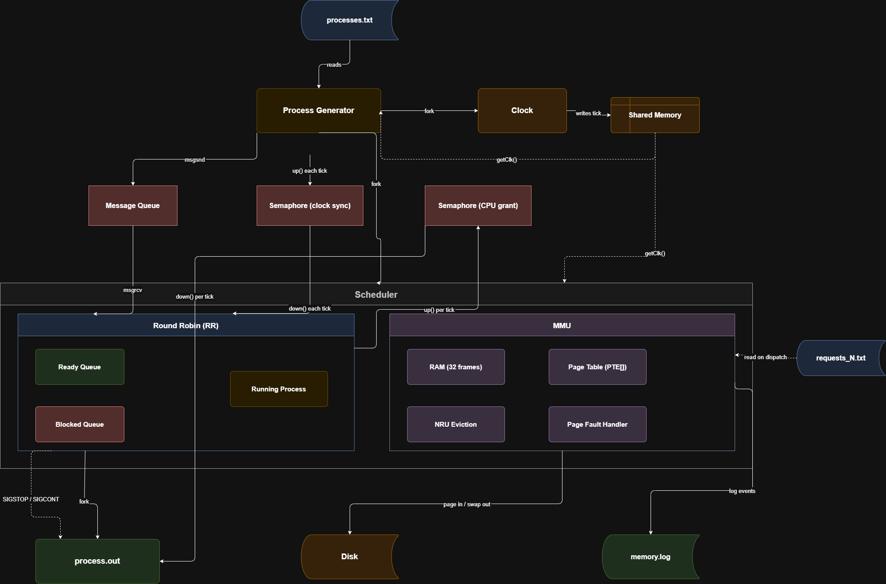

# OS Memory Management System

> Paging, Demand Paging, and NRU Page Replacement integrated with a Round Robin CPU Scheduler



---

## Table of Contents

- [Overview](#overview)
- [System Architecture](#system-architecture)
- [Memory Model](#memory-model)
- [Key Components](#key-components)
- [Data Structures](#data-structures)
- [Algorithms](#algorithms)
  - [Round Robin Scheduling](#round-robin-scheduling)
  - [Demand Paging](#demand-paging)
  - [NRU Page Replacement](#nru-page-replacement)
- [Process Lifecycle](#process-lifecycle)
- [IPC Mechanisms](#ipc-mechanisms)
- [Input Format](#input-format)
- [Output Files](#output-files)
- [Build & Run](#build--run)
- [File Reference](#file-reference)
- [Team](#team)

---

## Overview

This project implements a **simulated operating system kernel** in C on Linux, covering two of the most fundamental OS responsibilities: **CPU scheduling** and **memory management**.

Phase 2 extends the Phase 1 Round Robin scheduler with a full **paging subsystem**. The simulator models a single-CPU machine with a small physical memory. Processes hold virtual address spaces on disk and pages are loaded on demand. When physical memory is exhausted, the **NRU (Not Recently Used)** page replacement algorithm evicts the least-recently-used clean page to make room.

All components run as separate Linux processes that communicate via **System V IPC** (shared memory, message queues, and semaphores), giving the simulation realistic inter-process coordination semantics.

---

## System Architecture

```
┌─────────────────────────────────────────────────────────────────┐
│                        process_generator                        │
│  Reads processes.txt → sends ProcessMsg to msg queue per tick  │
└────────────────────────┬────────────────────────────────────────┘
                         │  Message Queue (ProcessMsg)
                         ▼
┌─────────────────────────────────────────────────────────────────┐
│                         scheduler                               │
│                                                                 │
│   ┌──────────────────────────────────────────────────────────┐  │
│   │                     RR.c  (CPU loop)                     │  │
│   │                                                          │  │
│   │  ready_q ──► [dispatch] ──► running_process             │  │
│   │  blocked_q ◄── [page fault] ◄── access_memory()        │  │
│   │  blocked_q ──► [wakeup]  ──► complete_page_fault()     │  │
│   └─────────────────────────┬────────────────────────────────┘  │
│                             │  calls                            │
│   ┌─────────────────────────▼────────────────────────────────┐  │
│   │                     MMU.c  (memory)                      │  │
│   │                                                          │  │
│   │  RAM[32 frames]   page tables   NRU eviction            │  │
│   │  allocate_page_table()  access_memory()  nru_evict()    │  │
│   └──────────────────────────────────────────────────────────┘  │
└──────────────────────────────────┬──────────────────────────────┘
                                   │  forks
                                   ▼
                          ┌────────────────┐
                          │  process.out   │
                          │ (one per proc) │
                          └────────────────┘

          ┌──────────────────────────────────────┐
          │  clk.c  — shared-memory clock (1 Hz) │
          └──────────────────────────────────────┘
```

The **process generator** and **scheduler** each run as a separate process. The **clock** increments a shared integer once per real second. All components synchronize against this clock through a semaphore that the clock signals each tick.

---

## Memory Model

| Parameter | Value |
|---|---|
| Address space | 10-bit byte-addressable |
| Total addresses | 1024 bytes |
| Physical RAM | 512 bytes |
| Page size | 16 bytes |
| Physical frames | 32 |
| VPN bits | 6 (bits 9–4 of virtual address) |
| Offset bits | 4 (bits 3–0) |
| Disk penalty — clean page evicted | 10 ticks |
| Disk penalty — dirty page evicted | 20 ticks |
| Context switch overhead | 1 tick |

Virtual addresses in request files use hexadecimal notation (`0x00`, `0x10`, `0x1F0`, …). The MMU extracts the VPN as `address >> 4`.

---

## Key Components

### `clk.c` — System Clock
Creates a shared-memory integer and increments it once per real second. Every other process calls `initClk()` to attach to this shared memory and `getClk()` to read the current time. The process generator signals a semaphore after each tick to synchronize the scheduler's event loop.

### `process_generator.c` — Process Generator
Reads `processes.txt` at startup and sends a `ProcessMsg` through a System V message queue to the scheduler the moment each process's arrival time is reached. Also sends a sentinel end-of-stream message when all processes have been dispatched, then waits for the scheduler to finish before cleaning up IPC resources.

### `scheduler.c` — Scheduler Entry Point
Parses command-line arguments (`cpu_id`, `algorithm`, `total`, `quantum`, `k`), reconnects to the clock and message queue created by the generator, then calls `RR()`.

### `RR.c` — Round Robin CPU Loop
The main simulation loop. Each iteration corresponds to one clock tick and does, in order:

1. **Wake blocked processes** — scan `blocked_q`; any process whose `wakeUpTime ≤ current_time` has its page fault completed and is moved to `ready_q`.
2. **Consume the clock tick** — `down(sem_id)` synchronizes with the real-time clock.
3. **Advance the running process** — calls `access_memory()` to check for a memory event, then either increments performance counters or handles the resulting page fault / quantum expiry.
4. **Receive new arrivals** — drain the message queue for any process that arrived this tick.
5. **Handle quantum expiry** — stop the running process (SIGSTOP) if another process is waiting, then set a 1-tick context-switch penalty.
6. **Dispatch the next process** — when the CPU is idle and the context switch has elapsed, dequeue from `ready_q` and either fork a new `process.out` (first run) or send SIGCONT (resume).

The K-quantum R-bit clearance counter is maintained here. Every time `total_quantums_passed % k == 0`, `clear_all_r_bits()` is called so NRU classifications stay meaningful.

### `MMU.c` — Memory Management Unit
Owns the 32-frame `RAM[]` array and a `ProcessMemory[]` bookkeeping table. Provides six public functions:

| Function | Purpose |
|---|---|
| `initialize_MMU()` | Reset all frames and bookkeeping; open `memory.log` |
| `allocate_page_table(pcb, t)` | Load request file; allocate PT frame; load VPN 0 |
| `access_memory(pcb, rel_t, abs_t)` | Translate virtual address; return HIT / FAULT_10 / FAULT_20 |
| `nru_evict(is_modified*)` | Select and evict cheapest NRU class victim |
| `complete_page_fault(pcb, t)` | Assign reserved frame; update PTE; log disk load |
| `clear_all_r_bits()` | Reset R-bit in all resident data frames and their PTEs |
| `free_process_memory(pcb)` | Release all frames owned by a finished process |

### `process.c` — User Process Stub
Each logical process is represented by a real Linux process forked from the scheduler. It loops on `down(process_sem_id)` — blocking until the scheduler calls `up()` once per CPU tick — then decrements its remaining time. It exits when remaining time reaches zero.

---

## Data Structures

### `Frame` (RAM entry)
```c
typedef struct {
    int  occupied_process; // -1 if free
    int  loaded_VPN;       // virtual page number currently in this frame
    int  referenced;       // R-bit: set on any access, cleared by K-timeout
    int  modified;         // M-bit: set on write access
    bool is_free;
    bool is_PT;            // true → page-table frame, never evicted
    PTE *page_table;       // non-NULL only when is_PT == true
    int  pt_limit;         // number of PTEs (= process limit)
} Frame;
```

### `PTE` (Page Table Entry)
```c
typedef struct {
    int  PhysicalAddress; // frame number; -1 when not resident
    bool valid;
    int  refrenced;       // shadow of RAM[frame].referenced
    int  modified;        // shadow of RAM[frame].modified
} PTE;
```

### `PCB` (Process Control Block)
Extends the Phase 1 PCB with memory-management fields:

| Field | Description |
|---|---|
| `PT_PhysicalAddress` | Frame index holding this process's page table |
| `base` | Starting page number of this process image on disk |
| `limit` | Number of virtual pages belonging to this process |
| `wakeUpTime` | Absolute time when disk transfer completes |
| `requests` | Array of `Request` structs loaded from `requests_N.txt` |
| `request_count` | Length of `requests` array |
| `last_request_idx` | Cursor into `requests`; advances only forward |
| `reserved_frame` | Frame locked for the faulting page during disk wait |
| `pending_fault_vpn` | VPN that caused the current page fault |

### `Request`
```c
typedef struct {
    int  time;           // relative CPU-tick at which to access memory
    int  address;        // virtual byte address (decoded from hex/binary)
    char binary_addr[16]; // raw token from file (used in log output)
    char rwFlag;         // 'r' or 'w'
} Request;
```

### `CircQ` (Circular Queue)
Used for both `ready_q` and `blocked_q`. Stores `PCB` values (not pointers) so the scheduler owns all PCB state.

---

## Algorithms

### Round Robin Scheduling

- Configurable quantum Q (entered at startup).
- 1-tick context-switch penalty whenever the CPU switches between different processes — including when a running process page-faults and is replaced.
- Blocked processes (waiting for disk) are held in a separate `blocked_q` and re-enter `ready_q` only once `current_time >= wakeUpTime`.
- Performance metrics written to `scheduler.perf`: CPU utilisation, average weighted turnaround time, average waiting time, and standard deviation of WTA.

### Demand Paging

Pages are loaded **on demand** — only when the process explicitly requests them via its `requests_N.txt` file. The timeline is:

```
CPU tick T:  access_memory() detects fault
             → log "PageFault upon VA 0x.. from process N"
             → reserve a frame (find_free_frame or nru_evict)
             → set PCB.wakeUpTime = T + 10  (or + 20 if dirty eviction)
             → return PAGE_FAULT_10 / PAGE_FAULT_20

Scheduler:   move process to blocked_q, context_switch = 1

CPU tick T+10 (or T+20):
             complete_page_fault() assigns reserved frame to the VPN
             → log "At time T+10 disk address D for process N loaded into page F"
             process moves from blocked_q → ready_q
```

The two initial allocations when a process first runs (page-table frame + VPN 0 frame) are charged zero time, per the spec.

### NRU Page Replacement

NRU classifies every resident **data** frame (page-table frames are excluded) into one of four classes based on its R and M bits:

| Class | R | M | Cost |
|---|---|---|---|
| 0 | 0 | 0 | Cheapest — not referenced, not modified |
| 1 | 0 | 1 | Not referenced, modified |
| 2 | 1 | 0 | Referenced, not modified |
| 3 | 1 | 1 | Most expensive — referenced and modified |

The victim is the **first frame (lowest index)** in the lowest non-empty class. If the victim's M-bit is set, it is written back to disk first (20-tick penalty); otherwise only a load is needed (10-tick penalty).

To prevent all pages from permanently accumulating R=1, the scheduler clears all R-bits every **K quantums** (K is entered at startup). This periodic reset is what makes NRU classifications meaningful over time.

---

## Process Lifecycle

```
         ARRIVE                  DISPATCH
           │                        │
           ▼                        ▼
        [WAIT] ──────────────► [RUNNING]
                                  │   │   │
                    quantum expire │   │   │ page fault
                                  │   │   │
                                  ▼   │   ▼
                              [STOP]  │ [BLOCKED]
                                  │   │   │
                  ready_q re-entry│   │   │ disk done
                                  │   │   │
                                  └───┼───┘
                                      │ finish
                                      ▼
                                  [FINISHED]
```

State | Symbol | Description
--- | --- | ---
Waiting | `W` | In ready_q, never run before
Running | `R` | Currently on CPU
Stopped | `S` | Preempted, in ready_q
Blocked | `B` | Waiting for disk, in blocked_q
Finished | — | Done; memory freed

---

## IPC Mechanisms

| Mechanism | Key | Purpose |
|---|---|---|
| Shared memory | `SHKEY` | Clock integer (read by all) |
| Message queue | `MSGKEY1` | Generator → Scheduler process arrival messages |
| Semaphore | `SEMKEY` | Clock tick synchronization (scheduler blocks until clock fires) |
| Semaphore | `PROC_SEM_KEY` | Scheduler → process.out per-tick signal |

---

## Input Format

### `processes.txt`
```
#id   arrival   runtime   priority   base   limit
1     1         6         5          0      4
2     3         3         3          20     3
```
Fields are tab-separated. Lines beginning with `#` are comments. `base` is the starting page number of the process image on disk; `limit` is the number of virtual pages.

### `requests_N.txt` (one file per process)
```
#time   address   r/w
1       0x00      r
2       0x10      w
```
`time` is **relative CPU time** — the number of CPU ticks the process has consumed since it first started (not wall-clock time). `address` is a virtual byte address in hexadecimal. `r/w` is `r` for read or `w` for write.

---

## Output Files

### `memory.log`
Records all memory allocation and fault events. Graded automatically; the format must match exactly.

```
Free Physical page 0 allocated
Free Physical page 1 allocated
At time 1 disk address 0 for process 1 is loaded into memory page 1.
PageFault upon VA 0x10 from process 1
Free Physical page 2 allocated
At time 14 disk address 1 for process 1 is loaded into memory page 2.
```

### `scheduler.log`
Records process state transitions: started, stopped, resumed, finished, woke up from page fault.

```
At time 1 process 1 started arr 1 total 6 remain 6 wait 0
At time 4 process 1 stopped arr 1 total 6 remain 3 wait 0
At time 7 process 1 resumed arr 1 total 6 remain 3 wait 3
At time 10 process 1 finished arr 1 total 6 remain 0 wait 3 TA 9 WTA 1.50
```

### `scheduler.perf`
```
CPU utilization = 87.50%
Avg WTA = 1.75
Avg Waiting = 2.00
Std WTA = 0.43
```

---

## Build & Run

**Prerequisites:** GCC, Make, Linux (tested on Ubuntu 20.04+).

```bash
# Build all binaries
make

# Run the simulation
make run
```

At startup the program will prompt for:
```
Enter quantum: <Q>
Enter K timeout for NRU: <K>
```

`Q` is the Round Robin time quantum in ticks. `K` is the number of quantums between R-bit clearances — a larger K makes NRU less aggressive about clearing reference history; a smaller K makes it more so.

To clean build artifacts:
```bash
make clean
```

---

## File Reference

| File | Description |
|---|---|
| `process_generator.c` | Reads `processes.txt`; dispatches arrival messages; owns IPC cleanup |
| `scheduler.c` | Entry point for the scheduler process; routes to `RR()` |
| `RR.c` | Round Robin loop; integrates MMU calls; manages blocked queue |
| `MMU.c` | Memory Management Unit: frame table, page tables, NRU, fault handling |
| `MMU.h` | Public MMU API and return-code constants |
| `process.c` | User process stub: counts down remaining time via semaphore |
| `clk.c` | Emulated 1 Hz clock using shared memory |
| `clk_functions.c` | `initClk()`, `getClk()`, `destroyClk()` — used by all processes |
| `DataStructures.h` | `PCB`, `PTE`, `Frame`, `Request`, `Queue` type definitions |
| `DataStructures.c` | Linked-list queue operations |
| `circQ.h / circQ.c` | Circular array queue for `ready_q` and `blocked_q` |
| `headers.h` | Common system includes, IPC keys, constants, semaphore helpers |
| `Makefile` | Build rules and `run` target |
| `processes.txt` | Sample process list for testing |
| `requests_N.txt` | Per-process memory request files (N = process ID) |
| `memory.log` | Generated: memory event log (graded) |
| `scheduler.log` | Generated: scheduling event log |
| `scheduler.perf` | Generated: performance metrics |
| `phase2_BlockDiagram.png` | System architecture block diagram |

---
